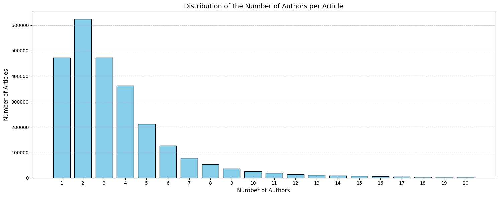
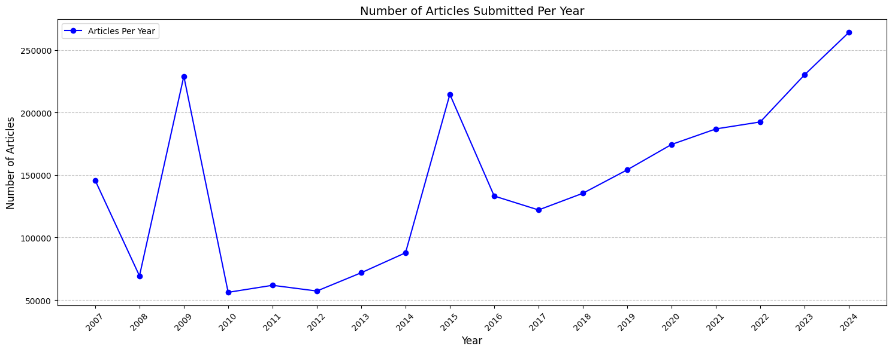

# Large-scale data analysis in pyspark framework

Some of tasks done in this Repo([papers' dataset](https://drive.google.com/file/d/1-EhpZaY5gvbgNuEU5IskmlQ0EnNAG5cu/view?usp=drive_link)):
- Clean the texts in the title and abstract fields if needed. 
- Remove mathematical symbols, meaningless characters in the text, remove stopwords, etc. 
- Calculate the number of articles in each category (e.g., ph-hep or co.math).
- Identify the category that has the most articles.
- Analyze the distribution of the number of authors in each article. 
<div style="text-align: center;">
    
</div>
- Filter articles that have more than three authors and list their titles and authors. 
- Draw the number of articles registered in each year. 
<div style="text-align: center;">
    
</div>

- Extract and display 20 frequently used words in the abstract section of the article.
```markdown
20 most frequent words in abstract:
model : 1188676
data : 917131
results : 859049
show : 831879
using : 809828
also : 774216
two : 719284
models : 686537
paper : 650231
study : 596891
method : 596084
quantum : 573410
system : 559067
new : 550050
field : 544587
based : 527532
one : 518005
time : 506071
different : 497350
present : 477899
```
- Find the articles in which the word algorithm is mentioned in their abstract. 
- Count the number of words in the abstract of this article 
- Arrange them in descending order based on the number of words. 
- Display the five articles with the highest number of words in the abstract as the final result.   
```markdown
Top 5 articles with the highest word counts in their abstract (containing 'algorithm'):
Title: The Nonlinearity Coefficient - A Practical Guide to Neural Architecture
  Design, Word Count: 498
Title: Generating a Generic Fluent API in Java, Word Count: 488
Title: Boxicity and Poset Dimension, Word Count: 484
Title: An Anytime Algorithm for Optimal Coalition Structure Generation, Word Count: 484
Title: McMini: A Programmable DPOR-Based Model Checker for Multithreaded
  Programs, Word Count: 475
```